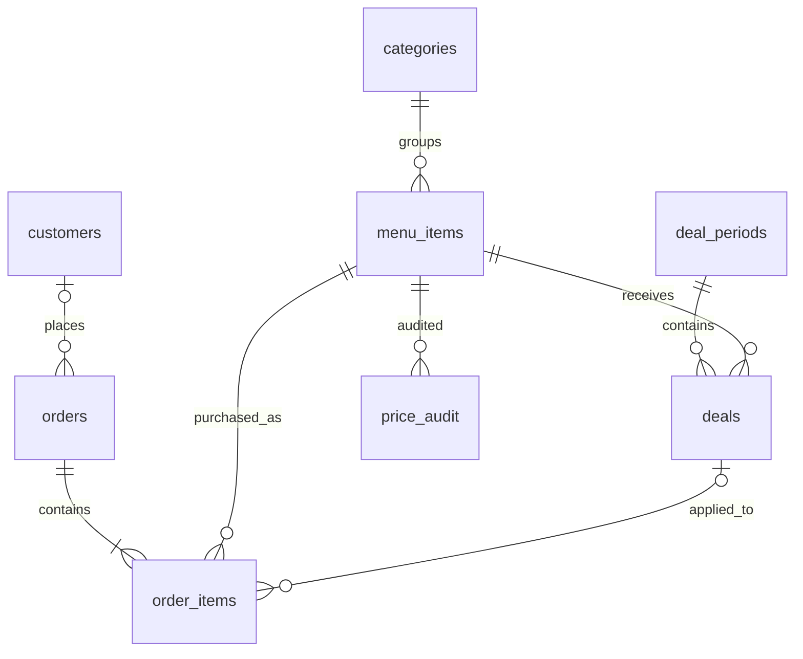

# Meta Menu

A SQL-focused restaurant project. Daily discovery deals promote less-ordered dishes while keeping each deal price fixed for its entire day. Built with **MySQL 8, Express, React, Vite, and custom responsive CSS**. No ORM is used.

## Run locally

This workspace has an isolated MySQL 8 instance in `.local/mysql` on **127.0.0.1:3307**, separate from the system MySQL service. Its generated application credentials live in ignored `.env`. Do not commit or share that file.

```powershell
npm install
npm run dev
```

Open **http://127.0.0.1:5173**. The API listens on **127.0.0.1:3001**. The development launcher starts the isolated database if needed. `MYSQLD_PATH` can override the default Windows MySQL executable location. Stop the launcher with Ctrl+C. The database files persist across restarts.

For a production frontend build served by Express:

```powershell
npm run build
npm start
```

Then open http://127.0.0.1:3001 while MySQL is running.

## First setup on another Windows machine

Install Node.js and MySQL 8.0.16 or later. From the repository root:

```powershell
npm install
New-Item -ItemType Directory -Force .local/mysql
& 'C:/Program Files/MySQL/MySQL Server 8.0/bin/mysqld.exe' --no-defaults --initialize-insecure --basedir='C:/Program Files/MySQL/MySQL Server 8.0' --datadir="$PWD/.local/mysql"
& 'C:/Program Files/MySQL/MySQL Server 8.0/bin/mysqld.exe' --no-defaults --datadir="$PWD/.local/mysql" --port=3307 --bind-address=127.0.0.1 --mysqlx=0 --console
```

Keep that terminal running. In another terminal run `npm run db:setup`, then `npm run dev`. The setup script assigns generated passwords immediately, creates an application user scoped to `meta_menu`, imports SQL, and seeds sample sales only if the menu is empty. It targets the dedicated local instance; do not point it at an existing database server. For a manually managed server, import the SQL files using an administrative account and configure `.env` from `.env.example` instead.

## Demonstration

1. Browse categories or select Discovery deals. Add dishes and change quantities.
2. Review the order, enter a name, and confirm. The receipt uses stored sale prices. Payment is **pending at the counter**; no money is collected.
3. Open Restaurant dashboard. Today's orders, units, and revenue update from MySQL.
4. Generate tomorrow's deals. Repeat the action to demonstrate idempotency.
5. Edit a regular price; earlier receipts and generated deal prices stay fixed. Inspect `price_audit` to see the trigger output.

Seed data contains 12 dishes and 84 clearly identified sample orders covering seven prior days. Sales charts show real queries over that sample data; today's activity starts at zero. Photographs are illustrative remote assets and need an internet connection. The interface remains usable if they fail to load. The banner photo is by Wayne W on [Unsplash](https://unsplash.com/photos/pasta-with-pesto-basil-and-sun-dried-tomatoes-_lUSd6TFTNE).

## Business rules

- Restaurant time is the local MySQL server time; the current setup uses the machine's India timezone. Period boundaries are start-inclusive and end-exclusive.
- Daily generation evaluates the **previous seven complete calendar days**, ending at today's midnight. Tomorrow's deals generated today use that same completed window, recorded explicitly on `deal_periods`.
- Only completed orders count. Unavailable items, items younger than seven days, and zero-discount items are excluded.
- Eligible dishes are ranked by units within category, ascending; equal units are resolved by item ID. Categories with no eligible sales receive no deal. Zero-sale dishes remain candidates when their category has sales.
- The discount is `MIN(15, max_discount_pct)` percent, rounded to two decimals. It is not recalculated after each order.
- One immutable period is generated per date, including an empty period. Repeated generation does not replace it. A named lock and transaction serialize generation.
- The admin sets today or tomorrow explicitly. There is no background scheduler in version one. Existing deals expire automatically because the menu view filters by time.
- Checkout locks the selected menu rows, validates the client's quoted prices against MySQL, and saves the entire order in one transaction. A changed price or unavailable item returns HTTP 409 for review.
- A unique request key makes retries return the same order. Names and prices are saved as historical snapshots in `order_items`.
- Regular price/discount edits affect future periods. Availability changes apply immediately. Dishes are marked unavailable rather than deleted, preserving order history.

## Database design

Seven core tables plus the trigger audit table:



`sql/01-schema.sql`: keys, checks, relationships, indexes, `current_menu` and `order_totals` views.

`sql/02-routines.sql`: the deal-generation stored procedure (CTEs, LEFT JOIN, aggregation, ROW_NUMBER, transactions, locking, exception handling), and the regular-price audit trigger.

`sql/03-analysis.sql`: report queries, ranking and EXPLAIN examples.

`server/index.mjs`: parameterized SQL and the checkout transaction. Order placement intentionally stays an explicit backend transaction for readable error handling; deal policy lives in a stored procedure.

Money uses DECIMAL in MySQL; the browser sums integer paise. Totals are calculated from order lines instead of copied into orders and bills. Historical price/name snapshots record facts about the sale, not the current menu. Sample customers are not authenticated accounts; each checkout records a new customer entry.

## Validation

With the API running, execute `npm test`. Integration tests exercise real MySQL constraints and transactions, deal bounds, duplicate generation, stale-price rollback, concurrent duplicate checkout, immutable receipts, the audit trigger, invalid quantities, and unavailable items. Tests clean up their orders and restore edited dishes; price-audit records of test changes remain. Run on this local demo database only.

`npm run build` validates the frontend production bundle.

The frontend optionally registers `read_meta_menu` and `stage_meta_menu_cart` when a browser supports `document.modelContext`. Staging never submits an order. This experimental browser integration is feature-detected; it has not been verified in a supported WebMCP browser. Ordinary UI operation does not depend on it. Browser interaction/visual testing has not been performed; API integration tests and the production build were run.

## Scope

This is a localhost resume demonstration with an unauthenticated admin screen. It binds to loopback and checks browser origins. Authentication/authorization, real payment processing, hosting, automatic scheduling, and kitchen fulfillment are deliberately outside this version. Add authentication before exposing it publicly. No claims of revenue improvement or query speedup are made without measured evidence.
